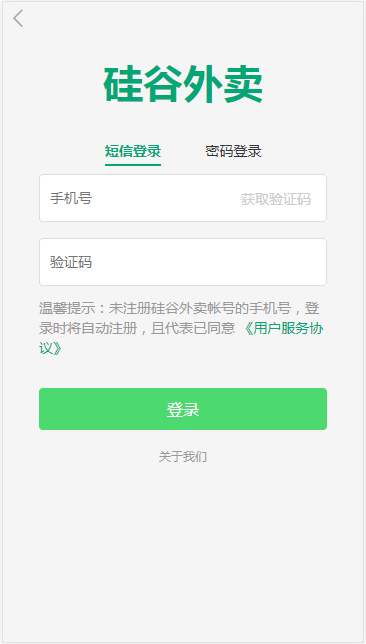

# gshop_client

> A Vue.js project

## Build Setup

``` bash
# install dependencies
npm install

# serve with hot reload at localhost:8080
npm run dev

# build for production with minification
npm run build

# build for production and view the bundle analyzer report
npm run build --report
```

For a detailed explanation on how things work, check out the [guide](http://vuejs-templates.github.io/webpack/) and [docs for vue-loader](http://vuejs.github.io/vue-loader).

## 运行要求
* API接口服务器使用 gshop-server_final（作为API服务器端）
```
# 地址
https://github.com/cucker0/gshop-server_final

```

## 效果图





## 其他
this.$store.dispatch()传回调函数方法，是以数据的方法传递的
```
举例：
组件中使用下面这处方式给action传回调函数
  mounted () {
    // 获取商家评论
    this.$store.dispatch('getShopRatings',
      {
        shopId: this.$route.params.id,
        callback: () => {
          this.$nextTick(() => {
            // eslint-disable-next-line
            new BScroll(this.$refs.ratings, {
              click: true
            })
          })
        }
      })
  }

action后端
  // 异步获取商家评价列表
  async getShopRatings ({commit}, {shopId, callback}) {
    // commit
    // {}:要传的数据，这里可以包含函数
    const result = await reqShopRatings(shopId)
    if (result.code === 0) {
      const shopRatings = result.data
      commit(RECEIVE_SHOP_RATINGS, {shopRatings})
      // 数据更新了，通知一下组件
      callback && callback()
    }
  }

#


```

## 第三方组件
* Moment.js时间组件
```
# 网址
http://momentjs.cn/

# 安装
bower install moment --save # bower
npm install moment --save   # npm
Install-Package Moment.js   # NuGet
spm install moment --save   # spm
meteor add momentjs:moment  # meteor

# 使用
import Moment from 'moment'
获取时间戳 : var res = Moment(Date.now(), 'YYYY-MM-DD HH:mm:ss').valueOf();
获取格式时间: var res = Moment(Date.now()).format('YYYY-MM-DD HH:mm:ss');


```
* better-scroll滑动组件

```
# 网址
http://ustbhuangyi.github.io/better-scroll/doc/api.html

# 安装
better-scroll 托管在 Npm 上，执行如下命令安装：

npm install better-scroll --save
接下来就可以在代码中引入了，webpack 等构建工具都支持从 node_modules 里引入代码：

# 使用
import BScroll from 'better-scroll'

new BScroll('.xx-class', {
  click: true,
  probeType: 2 // 1, 2, 3
})

```

* mock模拟数据组件
```
# 网址
http://mockjs.com/
https://github.com/nuysoft/Mock/wiki/Getting-Started

# 安装
npm install mockjs --save

# 使用
1.创建mockServer.js 文件，内容如下：
import Mock from 'mockjs'
import data from './data'

// 返回goods列表接口
Mock.mock(/\/goods\/\d{1,}/, {code: 0, data: data.goods})

// 返回ratings列表接口
Mock.mock(/\/shop_ratings\/\d{1,}/, {code: 0, data: data.ratings})

// 返回good Info列表接口
Mock.mock(/\/shop_info\/\d{1,}/, {code: 0, data: data.info})

// 这里不需向export任务方法、变量、对象等。所以不需要写export default xxx

2.main.js文件中引入mock
import './mock/mockServer' // 引入mockServer


```

* mint-ui 移动端ui组件
```
# 网址
http://mint-ui.github.io/#!/zh-cn

# 安装
npm i mint-ui -S

# 使用
1、完整引用
main.js中引入
import MintUI from 'mint-ui'
import 'mint-ui/lib/style.css'

Vue.use(MintUI)

2、按需引入

2.1、.babelrc 文件plugins加入配置项

{
  "presets": [
    ["env", {
      "modules": false,
      "targets": {
        "browsers": ["> 1%", "last 2 versions", "not ie <= 8"]
      }
    }],
    "stage-2"
  ],
  "plugins": ["transform-vue-jsx", "transform-runtime", ["component", [
    {
      "libraryName": "mint-ui",
      "style": true
    }
  ]] ]
}

2.2、在需要使用的组件中引入
import { MessageBox, Toast } from 'mint-ui'

```

* vue-lazyload 图片懒加载
```
# 网址
https://github.com/hilongjw/vue-lazyload

# 安装
npm install vue-lazyload -S

# 使用
main.js文件中引入vue-lazyload

import VueLazyload from 'vue-lazyload'
Vue.use(VueLazyload, {
  preLoad: 1.3, // 预加载调度比例
  error: 'dist/error.png', // 加载出错显示的图片
  loading: 'dist/loading.gif', // 加载中显示的图片
  attempt: 1 // 尝试次数
})


组件中
  
```

* date-fns 轻量级的 JavaScript 日期库
```
# 网址
https://date-fns.org/docs/Getting-Started

# 安装
Vue.filter('timeFormat', (value, formatStr = 'YYYY-MM-DD HH:mm:ss') => {
  return moment(value).format(formatStr)
})

# 使用
import format from 'date-fns/format'
format(value, formatStr)

```

